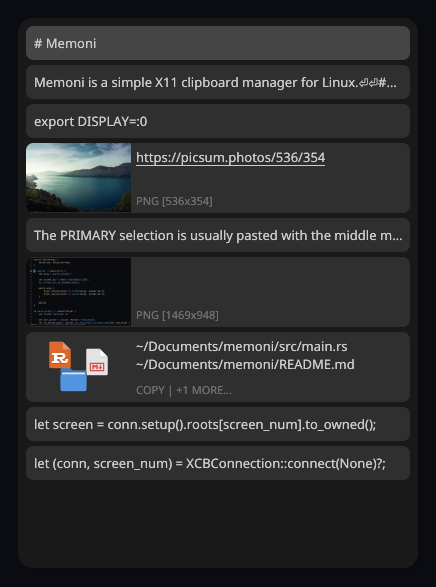

# Memoni

Memoni (MEMOry MONItor) is a simple X11 clipboard manager for Linux.

<p align="center">
  
</p>

## Features

- **Dual selection support**: separate servers for CLIPBOARD and PRIMARY that can run simultaneously.
- **Pointer-aware window placement**: window follows the pointer; centers on focused monitor when the pointer is hidden (e.g., typing in the terminal) or on another monitor.
- **Automatic pasting**: automatically pastes the selected item using Ctrl+V, with the option to customize the paste keymap per application.
- **Rich previews**: image thumbnails (PNG/JPEG/GIF/SVG) with alt text and source, file icons via freedesktop cache and device's icon theme.
- **Vim-inspired keymaps**: J/K, Ctrl-N/P, Ctrl-U/D, Ctrl-B/F, gg, G for navigation; Enter/Space to paste; Esc to hide; press ? for full keymap list.
- **Capturing everything**: text, images, file references, or anything else you copy; persistently saved across sessions.

## Building

Requirements:

- Linux/X11 with OpenGL/EGL
- fontconfig (only if using custom fonts)

```
cargo build --release
```

## Usage

- Start a server (default CLIPBOARD):

  ```
  memoni server
  ```

- Start a PRIMARY server:

  ```
  memoni server --selection PRIMARY
  ```

- Show the window:

  ```
  memoni
  ```

  ```
  memoni --selection PRIMARY
  ```

## Configuration

Customize the behavior and appearance via the configuration file at `$XDG_CONFIG_HOME/memoni/config.toml`. Note that the application does not automatically create this file; you will need to create it manually.

See [sample_config.toml](./sample_config.toml) for a complete list of options and examples.

## Credits

- [Noto Sans](https://fonts.google.com/noto/specimen/Noto+Sans) (SIL Open Font License)
- [Noto Emoji](https://fonts.google.com/noto/specimen/Noto+Emoji) (SIL Open Font License)
- [Noto Sans Symbols 2](https://fonts.google.com/noto/specimen/Noto+Sans+Symbols+2) (SIL Open Font License)
